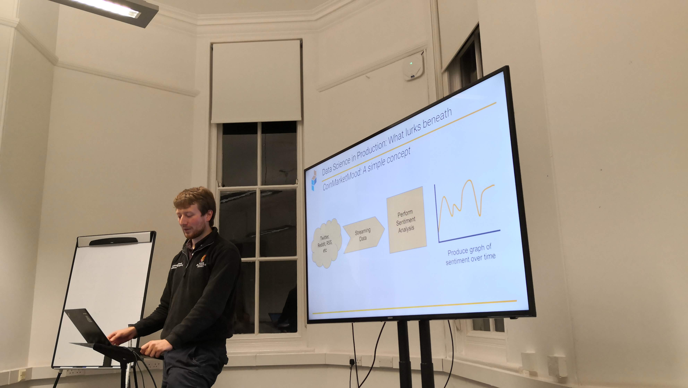

I'm Will. I'm an engineer with a PhD in Unsupervised Change Detection. I'm the co-founder of [Sourcepulp](https://sourcepulp.consulting), a growing, 
award-winning agile software consultancy. Since 2013 we've been helping clients ranging from micro businesses to government departments deliver new projects,
rescue legacy code nightmares and digitally transform.

I simply can't make my mind up about what kind of engineering role I like most. So far I've worked as

- Developer
- Infrastructure Engineer
- Data Scientist 
- Data Engineer 
- Machine Learning Engineer
- Tech Lead

and I'm sure this won't be the extent of it.

If you'd like to get in touch, drop me an email at [will@faithfull.me](mailto:will@faithfull.me), or DM me on [Twitter](https://twitter.com/DrFaithfull). [Here](https://will.faithfull.me/cv)'s my CV.