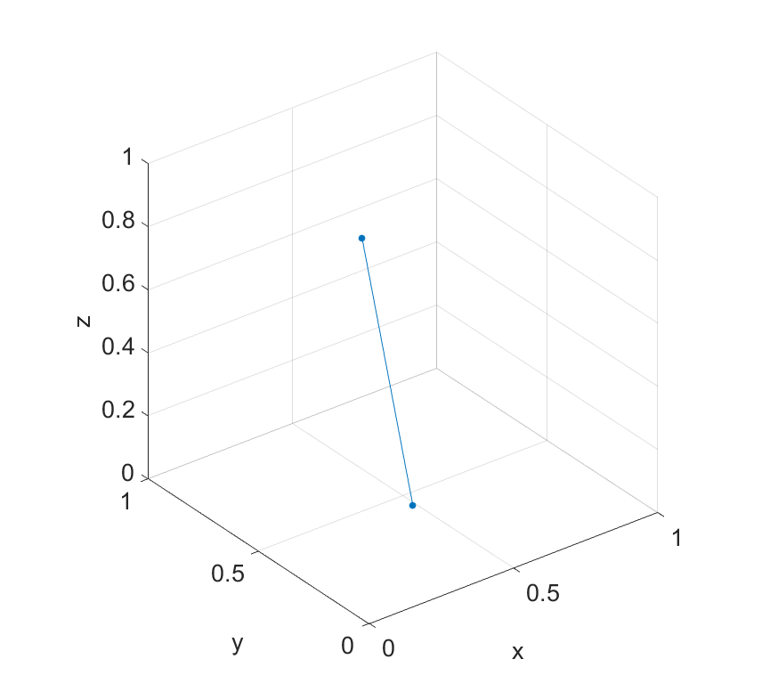

A significant part of my PhD research [1,2,5] has involved the application of PCA (Principal Components Analysis) in unsupervised change detection problems. Working with high-dimensional streaming data, I typically have to work on the assumption that we have no context and no data in advance. We also often need to reduce the dimensionality of the problem - a common application of PCA. We can only work with what we have already seen, so getting your algorithm up and running quickly, even with partial representations of the problem, is of great importance. The code examples in this article will be in MATLAB (sorry) because the tools available make the amount of code minimal. I expect you to already be familiar with what PCA is and what it does (again, sorry, but a full explanation of PCA is way outside the scope of this short post).

So, I want to talk briefly about the application of PCA when you have less samples than dimensions, because the results can be confusing and counter-intuitive to start with. 

Let's begin by applying PCA in a normal situation, where we have more samples than dimensions.

```
data = randn(1000,50);
[coeff, score, latent] = pca(data);
```

A PCA transformation can be boiled down to 

$$\mathbf{T} = \mathbf{X}\mathbf{W}$$

Where $\mathbf{X}$ is the original data, and $\mathbf{W}$ is a matrix of coefficients. In MATLAB terminology,  $\mathbf{X}$ is `data`,  $\mathbf{W}$ is `coeff` and $\mathbf{T}$ is `score`.

We expect `data` and `score` to have the same dimensions, because it is a transformation of the data into the principal component space. Sure enough, this is reflected in MATLAB.

```
>> size(data)

ans =

        1000          50

>> size(score)

ans =

        1000          50

>> 
```

Now let's take some data that is wider than it is long. We have 50 points in a 1000-dimensional space. Prime real estate for PCA to trim down.

```
data = randn(50,1000);
[coeff, score, latent] = pca(data);
```

The same rules apply, right?

```
>> size(data)

ans =

          50        1000

>> size(score)

ans =

    50    49

>> 
```

Wait, what? Our transformed data only has 49 dimensions instead of 1000. Why? Let's simplify the problem a little. 

Imagine instead that we have two points in a 3D space.

```
x = rand(2,1);
y = rand(2,1);
z = rand(2,1);
scatter3(x,y,z,'filled');

xlabel('x');
ylabel('y');
zlabel('z');

axis([0 1 0 1 0 1]); axis square;
line([x(1) x(2)],[y(1) y(2)],[z(1) z(2)])
```

```
>> [x,y,z]

ans =

    0.5470    0.7447    0.6868
    0.2963    0.1890    0.1835
```



It's clear when plotting them what the problem is. Principal components are the axes of most variance in the data. But in this case where we only have two points, there's only one axis of variance between them. This exact problem scales up into higher dimensions (but is harder to visualise). If we try to compute the principal component coefficients, we find sure enough that we only have 1 column (one component).

```
>> size(pca([x,y,z]))

ans =

     3     1
```

The rule is as follows [3, 4]:

> A sample of size $n$ with $p$ dimensions has at most $n - 1$ principal components if $n \leq p$. 

So effectively, we *can* derive principal components when we have less samples than dimensions, but only $n - 1$ components. In any case this is probably not desirable, because the sample is too small to to derive a fully meaningful transform. If you are planning to use the components to transform future elements of a stream for example, then it is better to wait for at least $p$ samples.

#### References

[[1](http://ieeexplore.ieee.org/abstract/document/6460338/)] Kuncheva, Ludmila I., and William J. Faithfull. "Pca feature extraction for change detection in multidimensional unlabelled streaming data." Pattern Recognition (ICPR), 2012 21st International Conference on. IEEE, 2012.

[[2](http://ieeexplore.ieee.org/abstract/document/6479367/)]
Kuncheva, Ludmila I., and William J. Faithfull. "PCA feature extraction for change detection in multidimensional unlabeled data." IEEE transactions on neural networks and learning systems 25.1 (2014): 69-80.

[[3](https://stats.stackexchange.com/q/28914)] ttnphns (https://stats.stackexchange.com/users/3277/ttnphns), PCA when the dimensionality is greater than the number of samples, URL (version: 2012-05-22): https://stats.stackexchange.com/q/28914

[[4](https://stats.stackexchange.com/q/123318)] GrokingPCA (https://stats.stackexchange.com/users/60334/grokingpca), Why are there only $n-1$ principal components for $n$ data if the number of dimensions is $\ge n$?, URL (version: 2017-10-19): https://stats.stackexchange.com/q/123318

[[5](https://www.researchgate.net/profile/Will_Faithfull/publication/328580385_Unsupervised_Change_Detection_in_Multivariate_Streaming_Data/links/5bd70ba74585150b2b8e6b2f/Unsupervised-Change-Detection-in-Multivariate-Streaming-Data.pdf)] Faithfull, William. Unsupervised Change Detection in Multivariate Streaming Data. Diss. Bangor University, 2018.