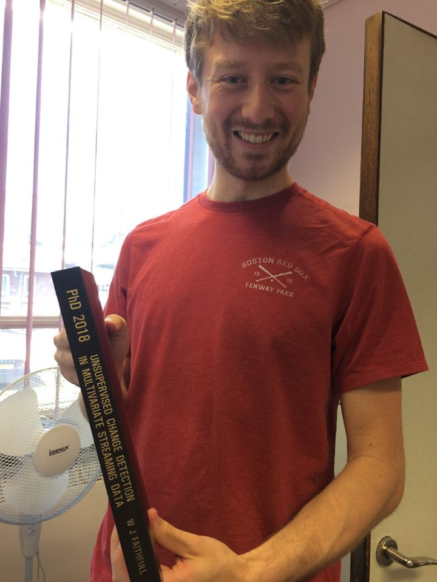
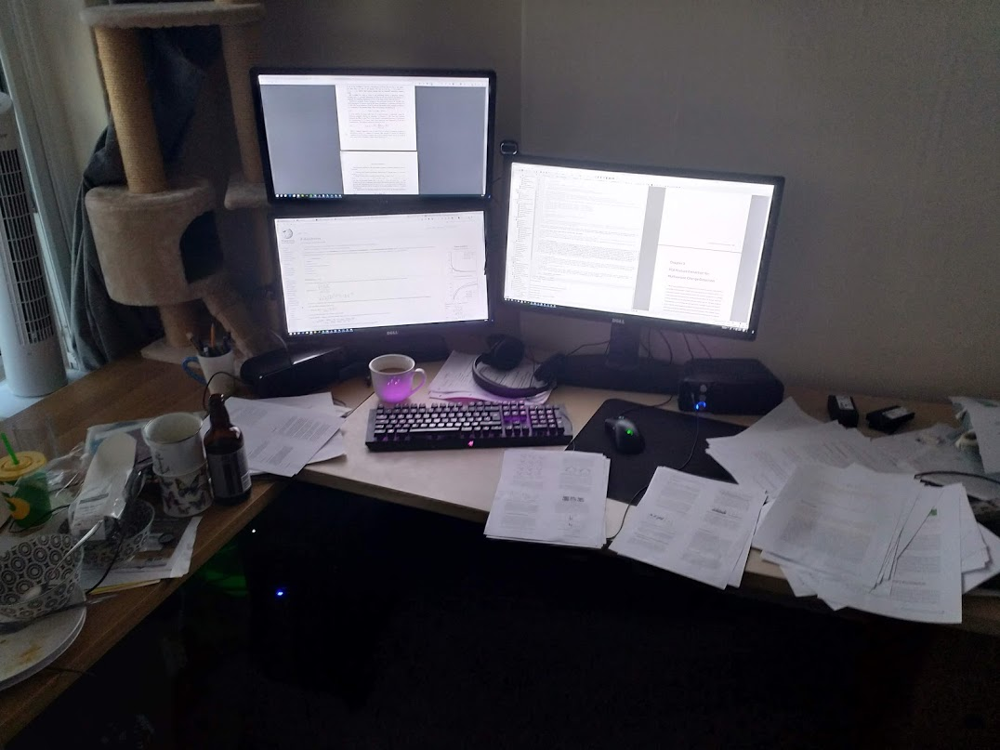

It's been a long road to get to this point, but I thought I'd condense my thoughts about the part-time PhD experience for anyone considering one.

To preface, if you're reading this thinking about starting a part time PhD, my advice to you is **don't**. Yes, really. Do it full time. I didn't even have to pay fees, and it was a hell of a struggle. If you've already started, or you simply disregard that advice, then I will start by explaining what I think you need **as a minimum** to get anywhere in a part time PhD.

* Weekly, uninterrupted, contiguous blocks of time. 
* Early direction from your supervisor.
* Discipline
* Leisure time

In the remainder of the post, I'll explain why, using my own experience as the justification. My own experience will be the quoted parts. Here's how I started:

> After getting my BSc in 2011, I started a part time PhD the following academic year. I was employed as a teaching assistant (Senior Demonstrator) in the Computer Science department, and as a member of staff, I was eligible for a fee-waiver on the PhD. This seemed like a great arrangement in 2011. The economy was in tatters, confidence in job prospects was at a low point. I could finish my PhD in a few years, and wait for the market to recover. I started along with another student on the same scheme - Francis Williams. We had distinguished ourselves in Bachelors and Masters respectively, and were confident that we were equal to the teaching.

### I. Weekly, uninterrupted, contiguous blocks of time.

Minimum 2 days per week, preferably at least 3. There's a massive efficiency curve that comes with cumulative days of work. It takes time to get into the groove of things, and if your  work time is peppered throughout the week, you'll never get enough work done to finish. In my opinion, productivity is described roughly by the function in Figure 1.

*
Figure 1. Productivity increases exponentially with cumulative time, and then plateaus. Part time students spend most of their time on the curve, while full time students spend most of their time on the plateau.
*

As a part time student, you are at a double disadvantage compared to full time - not only do you have less time, but you are almost always less productive in that time. If you don't keep your days contiguous, you're doomed to always sit on the left side of this curve. The more contiguous days you can scrap together, the further to the right you can get. This is the ultimate, ugly truth about part time study, and all the other points are related to this.

> We worked bloody hard for two years trying to balance teaching, resource preparation and marking with research, but came to realise it was unsustainable. We had a very heavy teaching load, heavier than many full time staff1 -- and it was split all over the week.
> 
> I founded my software consultancy business around this time, because I realised that I might never finish this PhD, and then I'd be stuffed with my (at the time) limited professional experience.
> 1. On-par in terms of contact hours, but we had taken over modules that needed extensive resource development.

### II. Early direction from your supervisor

As you've just seen, your work output is considerably less efficient per hour than someone on full time. Your supervisor needs to be heavily involved in the beginning if you are to have any chance of being self-sustaining in the long run. You literally don't have time to gain the necessary perspective in the beginning. That comes with collaboration and guidance. It takes a very long time to do a literature review when you're on the left of the curve.

> Lucy pushed the research direction (PCA for change detection). We went for publications - one conference and one journal paper, on which she was first author. We collaborated on concept, experiment and writing - the whole process. Having those two papers planted the root of the tree that would grow into a PhD.  
### III. Discipline

The cost of blowing off a day is much higher for part time. During your contiguous block, you have to be disciplined. Discipline comes with routine. If you can dedicate the same days every week, your mind snaps into focus more easily.

> I didn't have contiguous blocks of time reliably until I quit the teaching, in 2015. From 2013-2015 I had effectively stalled completely as I was building the business. I had just scraped together a first-authorship paper in 2014, but otherwise I was too busy to do anything at all, and had fallen into relative apathy.
> 
> In 2015, I moved to be with my partner, and my business was in good enough condition that I could work flexibly. This meant I was able to maximise my PhD blocks. From late 2015 to late 2017, I was able to hold a working rhythm of at least two contiguous days per week, often more. With rhythm and routine, came discipline. I was less jaded, I slacked off less, and got more done. This coincided with me conducting two big, journal-worthy studies. One published in Information Fusion, one (as of now) an unpublished PhD chapter.

### IV. Leisure time
Take evenings. Take weekends. Take holidays. For god's sake, don't try to smash 80+ hours a week. Especially for PhD work, I estimate that there are probably about 4-5 productive hours in a day. That doesn't invalidate what I've said about cumulative days and discipline - if you have worked your productive hours in a day, then be happy and draw a line under it. 

> 2013-2015 was the nadir of my PhD productivity. What work I was doing, I was trying to cram in at weekends and fit around my business. I was still committing long hours to it, but achieving nothing. This is unsustainable for your mental health. 

### V. Finishing up

I'll reiterate what I said at the start. **do it full time**. I don't regret it right now, but it's certainly been a difficult 6 and a bit years. The psychological strain only increases with time, and everyone has their breaking point. If you're in it part time

* Get a routine
* Make your PhD time contiguous in the week
* Dedicate minimum 2-3 days per week to PhD
* Avoid evenings and weekends if possible. Find flexible work, otherwise you will crack.

*
Figure 2. My desk mess after 8 solid days of draft corrections
*
