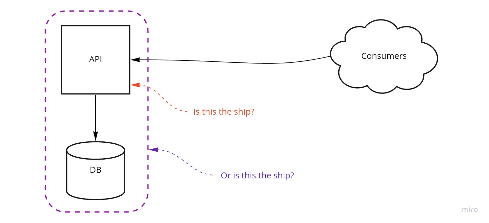
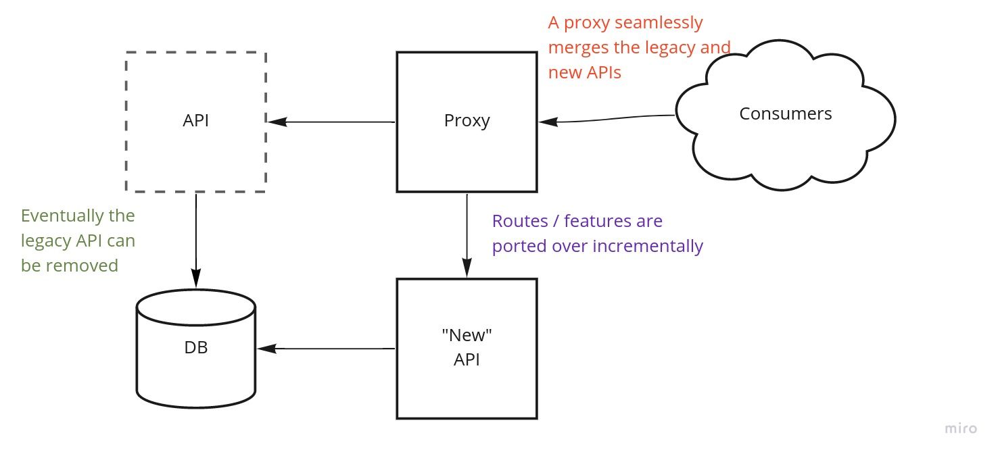

What does an [ancient thought experiment](https://en.wikipedia.org/wiki/Ship_of_Theseus) have to do with software engineering?

> The ship wherein Theseus and the youth of Athens returned from Crete had thirty oars, and was preserved by the Athenians down even to the time of Demetrius Phalereus, for they took away the old planks as they decayed, putting in new and stronger timber in their places, insomuch that this ship became a standing example among the philosophers, for the logical question of things that grow; one side holding that the ship remained the same, and the other contending that it was not the same.

*— Plutarch, Theseus*

A recurring theme I discuss with clients is *rewrites*. This is typically an option considered when there is an old, stubborn hard-to-maintain legacy application in the picture. 
Perhaps a new requirement has arisen, and there is a general fearfulness to try to iterate on this brittle foundation. A proper refactor seems equally out of reach. So should we begin again from scratch, **"but do it right this time"**?

Whilst the lack of conservatism in this attitude is commendable, it often ends in disaster. 
[Joel Spolsky's famous article](https://www.joelonsoftware.com/2000/04/06/things-you-should-never-do-part-i/) lays out the argument that contemplating a full rewrite from scratch is *never* a good idea. 
I won't reiterate the points from this article - I highly reccomend you at least skim it. Suffice to say I'm generally in agreement with him, although I try not to hold absolutist positions.

Let's assume this perspective is true, and that doing nothing is not an option. Then what options do you reccomend the above client?

Well, with regards to a rewrite, there is more than one way to skin a cat. In such a situation I invite you to consider the *Ship of Theseus* approach.
Just like the rotten parts of Theseus' ship were replaced piece-by-piece by the Athenians, so the client can replace the most rotten parts of their application, *in place*.

The most important feature of this approach is that it facilitates the breaking down of the overall problem
into *small, individually testable units of code*. We migrate an API route and structure / refactor it as we see fit, we migrate any existing tests and we write some new ones.
These can be tackled and prioritised as items, in line with the businesses' priorities, rather than as one big epic.

In the end, we are left with an unused pile of legacy cruft, which we can finally remove. 

This concept is pretty easy to grasp, but it can still easily fall at the first hurdle and just be another meaningless analogy. In a practical worked example, what is the ship? What are the rotten planks?

I'm probably going to disappoint you here, but I think this distinction is mostly contextual. My reasoning is thus: 

Recall that I said *in place*. What does that mean? I would consider it only to mean *seamless or unchanged from the point of view of the consumer*. I realise that some will disagree with this, but it gives us a wonderful flexibility with which to approach the problem.

We as developers can either change things within the existing application, or we can
begin another one, and incrementally port features across. Both of these are valid options, but
the latter approach can even appeal to developers who strongly believe that the existing application
is damaged beyond repair.

In my view, this remains a *Ship of Theseus* approach, as long as the existing implementations are first ported,
and then improved, rather than being wholly written from scratch. Taking this position can give developers the
freedom to only bring over the actual feature logic, rather than having to tackle the often turgid framework of the legacy application.

There's nothing magical about this, but I do think it is a useful philosophy for any digital consultant to bear in mind - especially if faced with the prospect of a rewrite. As to whether the application is the same one that we started with, I'll leave that to the actual philosophers.